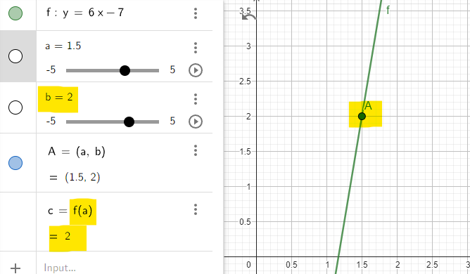

# Geometria analityczna
___

### 1. Warunek trójkąta
Algorytm sprawdza, czy z danych boków można utworzyć trójkąt.

```py 
def can_construct_triangle(a, b, c):
    conditions = [(a + b > c) , (b + c > a) , (c + a > b)]
    
    if all(conditions):
        return True
    else:
        return False
```

### 2. Położenie punktu względem prostej
Algorytm sprawdza, czy dany punkt leży po lewej czy prawej stronie prostej.

równanie prostej to y = f(x)
współrzędne punktu to (a, b)

Obserwacje:

- **jeśli b > f(a)**: 
punkt (a, b) leży nad (na lewo) prostą

- **jeśli b < f(a)**: 
punkt (a, b) leży pod (na prawo) prostą

- **jeśli b = f(a)**: 
punkt (a, b) leży na prostej



```py
def side_of_line(point, line):
# line = ax + b => line = [a, b]
# point = [X, Y]

    value = line[0] * point[0] + line[1]
    
    if value == point[1]:
        print("Point is on the line")
    elif value > point[1]:
        print("Point is below the line")
    elif value < point[1]:
        print("Point is above the line")

```

### 3. Punkt na odcinku
Algorytm sprawdza czy punkt (a, b) znajduje się na odcinku wyznaczonym przez punkty (x1, y1), (x2, y2).

Warunki:
1. Punkt musi leżeć na prostej wyznaczonej przez odcinek
2. x1 <= a <= x2

```py
def create_line(segment):
# return line's factors
    first_point, second_point = segment
    a = (first_point[1] - second_point[1])/(first_point[0] - second_point[0])
    b = first_point[1] - a * first_point[0]
    
    return [a, b]

def is_on_line(point, line):
    value = line[0] * point[0] + line[1]
    if value == point[1]:
        return True
    else:
        return False
    
    
def is_in_interval(point, segment):
    if point[0] >= segment[0][0] and point[0] <= segment[1][0]:
        return True
    else:
        return False

        
def is_in_segment(point, segment):
    line = create_line(segment)
    
    if is_on_line(point, line) and is_in_interval(point, segment):
        return True
    else:
        return False
    

```

### 4. Czy odcinki się przecinają
Załóżmy, że odcinki wyznaczone są przez punkty.

Odcinek XY - (x1, y1), (x2, y2)
Odcinek AB - (a1, b1), (a2, b2)

Przecinają się, gdy:
1. Jeżeli 2 końce odcinków są połączone ze sobą.
2. Jeżeli punkty (x1, y1) i (x2, y2) leżą po przeciwnych stronach prostej przechodzącej przez AB oraz punkty (a1, b1) i 
(a2, b2) leżą po przeciwnych stronach prostej przechodzącej przez XY
