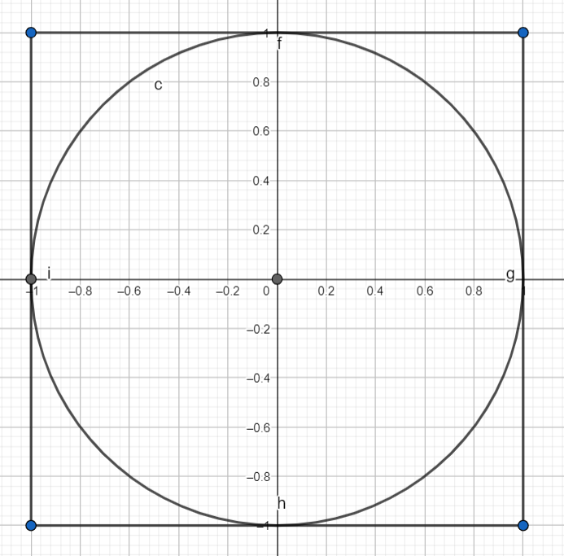

# Metoda Monte Carlo
___

Metoda Monte Carlo jest to metoda stosowana do modelowania matematycznego procesów zbyt złożonych, takich jak obliczanie całek,
aby można było przewidzieć ich wyniki za pomocą podejścia analitycznego. 

Istotną rolę w algorytmach stosujących metodę Monte Carlo 
**odgrywa losowanie elementu charakteryzującego
proces** (na przykład punktu na płaszczyźnie).

---

### Obliczanie przybliżonej wartości pi



Kwadrat o boku długości 2; okrąg opisany na tym kwadracie o promieniu 1 i środku w punkcie (0,0).

> pole_kola = pi

> pole_kwadratu = 4

> pi = 4 * pole_kola / pole_kwadratu

#### Algorytm:

1. Losujemy dużo punktów (im więcej punktów tym z większym prawdopodobieństwem lepiej przybliżymy wartość liczby pi)
z kwadratu (każdy punkt ma jednakowe prawdopodobieństwo wylosowania)
2. Liczymy ile z wylosowanych punktów znalazło się w kole
3. 4-krotność tej liczby podzielona przez liczbę wszystkich punktów to nasza 
przybliżona wartość liczby π

```python
import random

points = 100000
points_in_circle = 0

for i in range(points):
    x = random.uniform(-1, 1)
    y = random.uniform(-1, 1)
    
    if x*x + y*y <= 1:
        points_in_circle += 1

print(4 * points_in_circle / points)
```