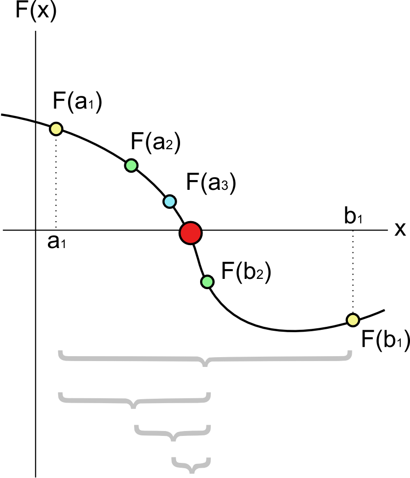

# Znajdowanie miejsca zerowego
___

Warunki:
- funkcja musi być ciągła
- musi mieć miejsce zerowe (początek przedziału i koniec o różnych znakach -> f(a) * f(b) < 0 )

## Metoda bisekcji (połowienia przedziałów)

### Przebieg

1. Wyznaczamy środek przedziału x1 = (a+b)/2
2. Sprawdzamy czy f(x1) jest równe 0; jeśli tak zwracamy x1 jako wynik
3. W przeciwnym wypadku, dopóki nie osiągniemy żądanej dokładności 
(dopóki spełniamy warunek |a-b| > epsilonZ): spośród przedziałów [a,x1] i [x1,b] 
wybieramy ten, którego wartości na końcach przyjmują różne znaki.
Innymi słowy, jeśli f(a)*f(x1) < 0 to przypisujemy b wartosc x1, wchodząc do tego przedziału;
w przeciwnym wypadku przypisujemy a wartość x1 wchodząc do przedziału [x1,b]
4. Po osiągnięciu wymaganej dokładności - spełnieniu warunku |f(x1)| <= =epsilon0, algorytm zwraca miejsce zerowe
(a+b)/2.

epsilonZ - dokładność na osi x, maksymalna odległość znalezionego przez nas miejsca zerowego od prawdziwego

epsilon0 - dokładność na osi y

