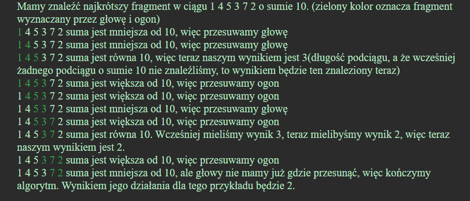

# Szukanie najdłuższego/najkrótszego podciągu o np. sumie równej X
___

### Użyjemy *metody gąsienicy*.

Polega ona na odpowiednim poruszaniu "głową" lub "ogonem".

**Głowa** opisuje **koniec** aktualnie rozpatrywanego przedziału, a **ogon** jego **początek**.

Jeżeli chcemy osiągnąć przedział o sumie k, to będziemy przesuwać nasze krańce w taki sposób:

- jeżeli suma w rozpatrywanym przedziale jest za mała, to przesuwamy głowę do przodu
- jeżeli suma w rozpatrywanym przedziale jest za duża, to przesuwamy ogon do przodu
- jeżeli suma w rozpatrywanym przedziale jest idealna, to odnotowujemy ten fakt i odpowiednio ustawiamy wynik; 
przesuwamy głowę do przodu

---
[Algorytm gasienicy](https://algorytmy.oki.org.pl/algorytm-gasienicy)