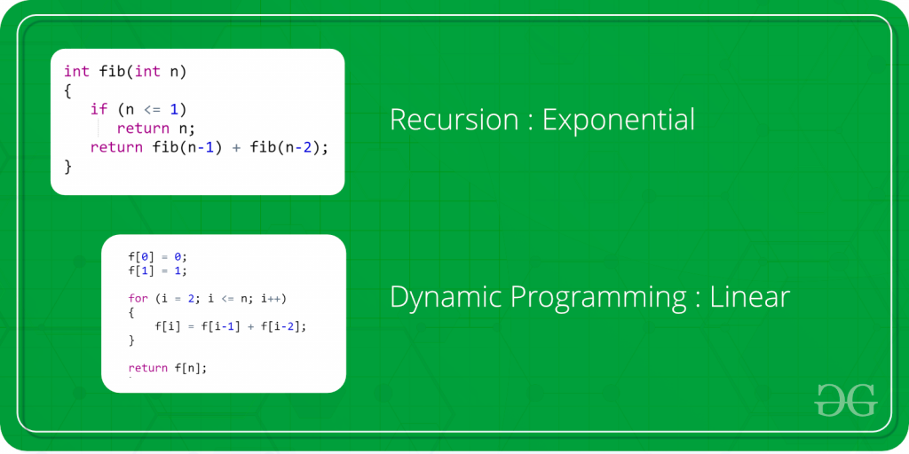

# Programowanie dynamiczne

---
Programowanie dynamiczne to technika rozwiązywania problemów optymalizacyjnych, która polega na rozwiązaniu problemu poprzez podział go na mniejsze, bardziej podstawowe podproblemy. Następnie rozwiązania tych podproblemów są przechowywane w tablicy lub pamięci podręcznej, aby uniknąć wielokrotnego rozwiązywania tych samych podproblemów, co pozwala na oszczędność czasu obliczeniowego.

Główne założenie programowania dynamicznego opiera się na zasadzie optymalnej podstruktury, co oznacza, że optymalne rozwiązanie globalnego problemu można skonstruować poprzez optymalne rozwiązania jego podproblemów. Ponadto, programowanie dynamiczne wykorzystuje zasadę najmniejszego podproblemu, co oznacza, że dla każdego podproblemu obliczane jest tylko jedno optymalne rozwiązanie, a nie wszystkie możliwe.

Kluczowym elementem programowania dynamicznego jest zapisywanie wyników obliczeń dla danego podproblemu i ponowne ich wykorzystywanie w razie potrzeby, co przyczynia się do efektywnego rozwiązywania problemów o dużym stopniu powtarzalności. Programowanie dynamiczne znajduje zastosowanie w wielu dziedzinach, takich jak algorytmy szeregów czasowych, optymalizacja tras, planowanie zasobów czy algorytmy grafowe.

[Dynamic Programming - Learn to Solve Algorithmic Problems & Coding Challenges](https://www.youtube.com/watch?v=oBt53YbR9Kk)

## Przepis:

- zauważ nakładające się problemy
- znajdź podstawowe wartości (base cases)
- rekurencyjnie - użyj memoizacji
- iteracyjnie - użyj tabulacji
- najpierw narysuj strategię!