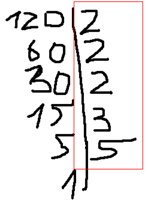

# Rozkład liczby na czynniki pierwsze 

---

Rozkład dodatniej liczby całkowitej na czynniki całkowite, które są liczbami pierwszymi.

Każda dodatnia liczba całkowita większa niż 1 jest albo iloczynem dwóch lub więcej czynników całkowitych i w tym przypadku nazywa się ją liczbą złożoną, albo nie jest, w takim przypadku nazywa się ją liczbą pierwszą.

### Implementacja
```py 
def prime_decomposition(num: int) -> list[int]:
    n = num
    factors = []

    if n > 1:
        i = 2
        while i <= n:
            if n % i == 0:
                factors.append(i)
                n = n//i
            else:
                i += 1
    return factors
```

### Przykład
```
n = 120
factors = []

120 > 1:
    i = 2
    i <= 120:
        120 % 2 ==0:
            factors.append(2)
            n = 120/2 = 60
        60 % 2 == 0:
            factors.append(2)
            n = 60/2 = 30
        30 % 2 == 0:
            factors.append(2)
            n = 30/2 = 15
        15 % 2 != 0:
            i = 2 + 1 = 3
        15 % 3 == 0:
            factors.append(3)
            n = 15/3 = 5
        5 % 3 != 0:
            i = 3 + 1 = 4
        5 % 4 != 0:
            i = 4 + 1 = 5
        5 % 5 == 0:
            factors.append(5)
            n = 5/5 = 1
            
factors = [2, 2, 2, 3, 5]

```



#### Złożoność obliczeniowa
$O(\sqrt{n})$