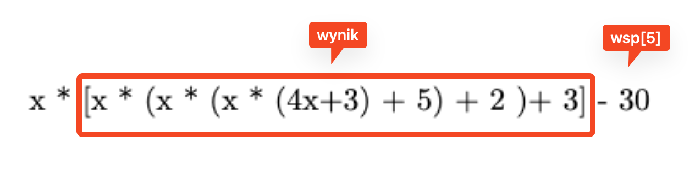

# Schemat Hornera
___

Obliczanie wartości wielomianu za pomocą schematu Hornera.

### Algorytm
___

### Przykład z objaśnieniem

#### Obliczamy wartość wielomianu dla x = 2

> W(x) = 4x^5 + 3x^4 + 5x^3 + 2x^2 + 3x - 30

Stopień wielomianu:
> st = 5

Współczynniki przy potęgach x:
> wsp = [4, 3, 5, 2, 3, -30]

###### Gdy nie ma danej potęgi w wielomianie np. x^2 w wielomianie x^3 + 2x + 1 to współczynnik wynosi 0

#### Ustalamy wynik jako wsp[0]
> wynik = wsp[0] #4

#### Iterujemy przez tablicę współczynników od pierwszego elementu do ostatniego i=1 -> i=len(wsp)+1
#### Ustalamy nowy wynik
> wynik = x * wynik + wsp[i]

czyli, zgodnie z przykładem:
> i = 1

> wynik = 2 * 4 + 3


### 1. Jesteśmy tutaj:


Ten jednomian jest naszym aktualnym wynikiem.

Wynik wynosi 11.

### 2. Następnie:
> wynik = x * wynik + wsp[2]

> wynik = 2 * 11 + 5


Wynik wynosi 27.

### 3. Następnie:

> wynik = x * wynik + wsp[3]

> wynik = 2 * 27 + 2


Wynik wynosi 56.

### 4. Następnie:

> wynik = x * wynik + wsp[4]

> wynik = 2 * 56 + 3


Wynik wynosi 115.

### 5. Następnie:

> wynik = x * wynik + wsp[5]
 
> wynik = 2 * 115 - 30



#### Zwracamy wynik po zakończonej pętli

> wynik = 200

### Wykonaliśmy 5 mnożeń, czyli tyle ile wynosi stopień wielomianu.

### Wyjaśnienie z zaznaczonymi współczynnikami


### Implementacja Python

```python
result = factors[0]

for i in range(1, degree + 1):
    result = x * result + factors[i]

print(result)
```

___
[Schemat Hornera](https://zpe.gov.pl/a/przeczytaj/D1HY1UbRJ)
