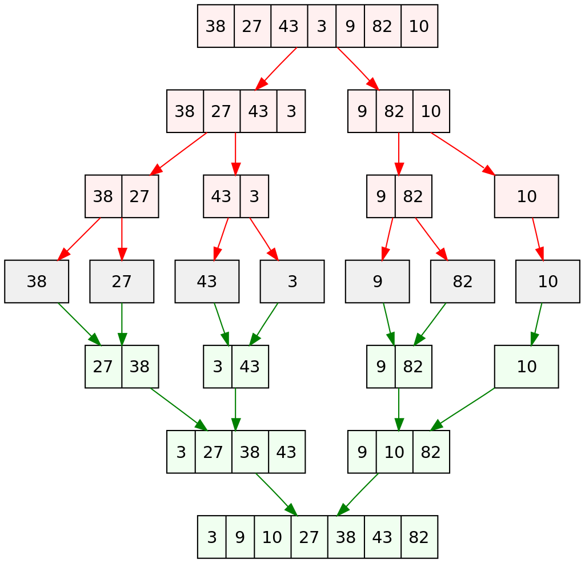

# Sortowanie przez scalanie

Rekurencyjnie dzieli tablicę na dwie części, sortuje i łączy ponownie.

### Opis algorytmu

---

Podziel podstawową tablicę na dwie części - lewą i prawą. Rekurencyjnie dziel do momentu uzyskania jednoelementowych tablic. Tablica jednoelementowa jest posortowana.

Następnie łącz podtablice, ustawiając elementy w odpowiedniej kolejności.
Porównuj ze sobą elementy z lewej połowy z elementami prawej połowy, do momentu, aż nie będzie elementów do porównania.

Scalona tablica jest posortowana.

---

    Może się zdarzyć sytuacja, że zostanie jeden element (w lewej lub prawej połówce), którego nie porównamy, więc po prostu go dodajemy do tablicy.

### Przykład


#### Porównujemy 27 i 3:

    27 > 3: dodajemy 3

    scalona tablica: [3]

#### Porównujemy 27 i 43:

    27 < 43: dodajemy 27

    scalona tablica: [3, 27]

#### Porównujemy 38 i 43:

    38 < 43: dodajemy 38

    scalona tablica: [3, 27, 38]

#### Brak elementu do porównania z 43:

    dodajemy 43

    scalona tablica: [3, 27, 38, 43]

---

### Ilustracja działania algorytmu

---



### Implementacja:

```py
def merge_sort(array: list[int]):
    length: int = len(array)
    # part containing one element is sorted
    if length <= 1:
        return

    # divide an array in two parts
    middle: int = length//2
    left_array: int = array[:middle]
    right_array: int = array[middle:]

    # divide those parts
    merge_sort(left_array)
    merge_sort(right_array)

    # merge parts
    merge(left_array, right_array, array)


def merge(left_array: list[int], right_array: list[int], array: list[int]):
    left_size: int = len(array)//2
    right_size: int = len(array) - left_size
    # indices:
    i: int = 0 # index of main array
    l: int = 0 # index of left half
    r: int = 0 # index of right half

    # loop until there is no element to compare in the both halves
    while l < left_size and r < right_size:
        # add smaller element to the result array
        if left_array[l] < right_array[r]:
            array[i] = left_array[l]
            i += 1
            # look for the next element of left half
            l += 1
        else:
            array[i] = right_array[r]
            i += 1
            # look for the next element of right half
            r += 1

    # if there is only one element left (cant compare to the other one), add the rest to the result array
    # might happen in left half or right half
    while l < left_size:
        array[i] = left_array[l]
        i += 1
        l += 1

    while r < right_size:
        array[i] = right_array[r]
        i += 1
        r += 1


seq: list[int] = [3, 6, 7, 2, 1, 3, 5, 9, 2, 0]
merge_sort(seq)
print(seq)
```

---

#### Złożoność obliczeniowa:

$O(n \log{n})$

#### Złożoność pamięciowa:

$O(n)$

---

[Merge Sort Algorithm in Java | Coding with John
](https://www.youtube.com/watch?v=bOk35XmHPKs)
