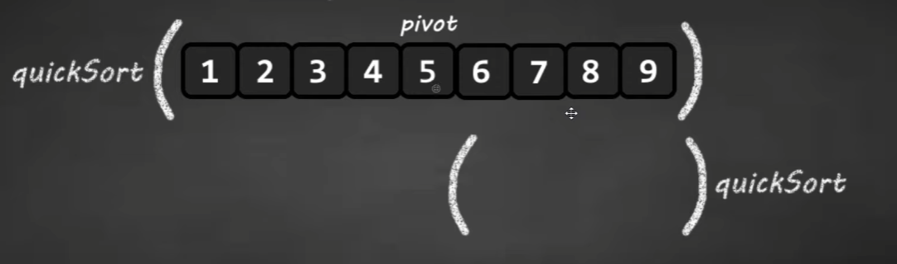

# Sortowanie szybkie

Przesuwa mniejsze elementy na lewo od pivota (punktu osiowego). Rekurencyjnie dzieli tablicę na dwie części.

### Opis algorytmu

- ustawiamy pivot na końcu tablicy (może być w dowolnym miejscu)
- chcemy znaleźć pozycję końcową wartości pivota
- ustawiamy dwa indeksy - `j` na początku naszej tablicy oraz `i` na pozycji -1 od początku tablicy
  
- sprawdzamy czy wartość na pozycji `j` jest mniejsza od wartości pivota:

  - jeśli jest większa, ignorujemy, zwiększamy `j` o 1
    

  - jeśli jest mniejsza, zwiększamy `i` o 1 oraz zamieniamy wartości na indeksach `i` i `j` ze sobą
    
    

- powtarzamy do momentu, aż `j` będzie na miejscu pivota
- gdy `j` będzie na miejscu pivota, zwiększamy `i` o 1 i zamieniamy wartości na indeksach `i` i `j` ze sobą
- teraz pivot znajduje się na właściwym miejscu
  

- elementy po lewej stronie pivota są od niego mniejsze, a elementy po jego prawej stronie są od niego większe lub równe

- dzielimy tablicę na dwie części:
  - lewą stronę (elementy po lewej stronie pivota)
  - prawą stronę (elementy po prawej stronie pivota)


- przekazujemy te dwie części do naszej rekurencyjnej funkcji jako argumenty


- wykonujemy wcześniejszy algorytm na tych partycjach




- nasza lista jest posortowana


---

### Implementacja:

```py
def quicksort(array: list[int], start=0, end=None) -> None:
    if end is None:
        end = len(array) - 1
    if start >= end or start < 0 or end >= len(array):
        return

    pivot: int = partition(array, start, end)
    # pass partitions recursively into quicksort function
    quicksort(array, start, pivot-1)
    quicksort(array, pivot+1, end)


def partition(array: list[int], start, end) -> int:
    # returns location of pivot
    # set pivot at the end
    pivot: int = array[end]
    i: int = start - 1

    for j in range(start, end):
        if array[j] < pivot:
            i += 1
            # swap
            array[i], array[j] = array[j], array[i]
        else:
            j += 1

    i += 1
    # final pivot position
    temp: int = array[i]
    array[i] = array[end]
    array[end] = temp

    return i


seq: list[int] = [8, 2, 5, 3, 9, 4, 7, 6, 1]

quicksort(seq, 0)
print(seq)

```

---

#### Złożoność obliczeniowa:

- średnia: $O(n \log n)$
- w najgorszym przypadku: $O(n^2)$

Ze względu na rekurencję.

#### Złożoność pamięciowa:

$O(n)$

W porównaniu z sortowaniem przez scalanie, nie potrzebujemy dodatkowej tablicy na obliczenia.

---

[Learn Quick Sort in 13 minutes | Bro Code](https://www.youtube.com/watch?v=Vtckgz38QHs&ab_channel=BroCode)

[Quick Sort [Visual Explanation] | Curious Walk](https://www.youtube.com/watch?v=WprjBK0p6rw&ab_channel=CuriousWalk)
