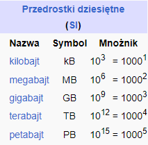

# Złożoność pamieciowa

Ilość pamieci potrzebnej do wykonania programu.

## Notacja O

### Definicja

Jeśli $n$ oznacza wielkość danych wprowadzanych do programu, a $T(n)$ oznacza liczbę bajtów pamięci używanej przez program i
$T(n) = O(f(n))$, to istnieje taka stała liczba naturalna $k$, że:

$T(n) \leq k \cdot f(n)$

Intuicyjnie $O(f(n))$ daje nam przybliżoną liczbę pamięci używanej przez program.

#### Przykłady
___
```py
a = int(input())
b = int(input())
c = a + b
```

Używane są trzy zmienne typu int. Niezależnie od danych złożoność pamięciowa będzie stała. Zatem możemy ją wyrazić w postaci notacji duże-O jako $O(1)$
___

```py
# n – długość ciągu
n = int(input())

# a - ciąg
a = []
for i in range(0, n):
	a.append(int(input()))
for i in range(0, n):
	for j in range(0, n - i):
		if a[j] > a[j + 1]:
			swap(a[j], a[j + 1])
```
Zmienne w programie:
- $n$ - int długość ciągu
- $a$ - lista reprezentująca n elementowy ciąg
- $i$, $j$ - liczniki pętli

Zmienne typu int zajmują 4 bajty pamięci w Pythonie.

Zmienne $n$, $i$, $j$ to zmienne typu int. Natomiast $a$ to lista zawierająca $n$ zmiennych typu int.

Zatem nasz program używa $ 4 + 4 + 4 + 4 \cdot n = 4n + 12 = 4(n + 3) = O(n)$ bajtów pamięci.
Natomiast złożoność czasowa programu to $O(n^2)$. 
___
1Bajt = 8bitów


___

```py
a = input()
print(a)
```
Zmienne:
- $a$ - string - ma różną długość

Jeden znak w Pythonie zajmuje od $1$ do $4$ bajtów, w zależności od kodowania. Nawet pusty string przechowuje informacje, więc zajmuje pewną ilość bajtów.

Nasz program zajmuje $c + 4 \cdot len(a)$ bajtów, gdzie $c$ jest stałe.

Zatem złożoność pamięciowa tego programu to $ O(len(a))$.